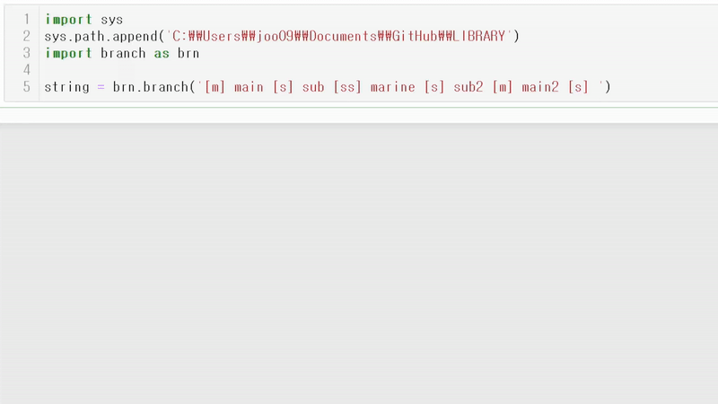

# BRANCH
**BRANCH is a user module** for expressing vertical / horizontal relationship between objects  
inspired by directory branches  
no additional libraries needed (acts only with lists)
  
  

  
  

******                                     

                                                       < Input >  
                                                       
    string = '[m] clothes [s] shirts [s] pants [ss] denim [sss] tapered [s] accessories [m] coffee [s] espresso [s] latte [m] Python [s] branch [ss] init_theme'   
              
***

                                                       < Result >  
                               - Default -                                    - Theme_korean -
                                                                              
                              .                                              .                
                              ├─clothes                                      ㅏㅡclothes 
                              │  ├─shirts                                    ㅣ  ㅏㅡshirts  
                              │  ├─pants                                     ㅣ  ㅏㅡpants   
                              │  │  └─denim                                  ㅣ  ㅣ  ㄴㅡdenim  
                              │  │     └─tapered                             ㅣ  ㅣ     ㄴㅡtapered   
                              │  └─accessories                               ㅣ  ㄴㅡaccessories   
                              │                                              ㅣ                     
                              ├─coffee                                       ㅏㅡcoffee     
                              │  ├─espresso                                  ㅣ  ㅏㅡespresso    
                              │  └─latte                                     ㅣ  ㄴㅡlatte  
                              │                                              ㅣ          
                              └─Python                                      ㄴㅡPython      
                                 └─branch                                      ㄴㅡbranch       
                                    └─init_theme                                  ㄴㅡinit_theme 

***                                       
        
                                                     < How to use >  
                                                     
                                                     
    1. branch making is only based on the bracketed sign and the sequence you write.
    
    2. [m] is for the top level titles, in this example, are 'clothes', 'coffee', 'Python'.
    
    3. [s] is sub-level of [m], [ss] is sub-level of [s], 
       continously, [sss] is sub-level of [ss]..
       
    4. the shape of the branch will be automatically made
   
    
***   

                                                     < How to import >  
    import sys
    sys.path.append(*location(dir) of branch.py*)
    import branch as brn

        
                                                    < How to re-import >  
    from imp import reload 
    reload(brn) 

***

                                                         < Code >  
    ( Default theme )                
    
    branched_string = brn.branch(string)
    
    
    ( apply theme )      
    
    themed_str = brn.branch_theme('theme_korean()', string)
    
    
    
    * you can also make your own theme, and replace 'theme_korean()' to the name of your defined theme function
    
***

